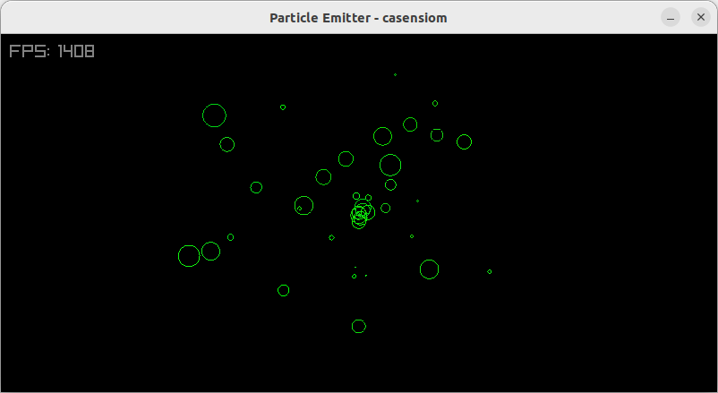
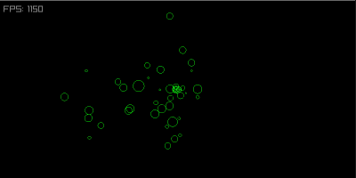

# Particle Emitter



Header only 3D Particle Emitter in C99

## About

[](https://github.com/casensiom/particle_emitter/actions)

This library computes 3d particles in pure C99.



The example uses [raylib](https://www.raylib.com) as a render engine.

## How to use

This library follows [single-file C/C++ public domain libraries](https://github.com/nothings/single_file_libs) rules.

Include the header file and the definition to include the implementation code in just one of the includes.

```c
#define PARTICLE_EMITTER_IMPLEMENTATION
#include "particle_emitter.h"
``` 

Refer the [examples](https://github.com/casensiom/particle_emitter/examples/exmaple0.c) to see the library usage.

### Create

Creates the emitter
```c
EmitConfiguration configuration;
configuration.particlesPerSecond = 30;
(...)
Emitter emitter = particle_emitter_create(configuration);
```

### Update
Update the particles
```c
particle_emitter_update(&emitter, dt);
```

### Destroy
Destroys the emitter
```c
particle_emitter_destroy(&emitter);
```

## Features
 - General forces (gravity, wind)
 - Attraction / Repulsion vortices
 - Friction
 - Particle attributes
    - rotation
    - scale
    - color

## Roadmap
 - Implement an editor
 - Load and save presets
 - Support more attributes
